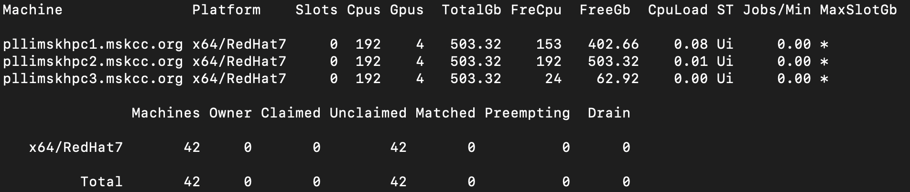

# Submitting Jobs (HTCondor)

## Cluster Setup


### Pool 1 - Research
- **Central manager node**: pllimskhpc1
- **Submit and Execute nodes**: pllimskhpc123


### Pool 2 - Engineering
- **Central manager node**: pllimsksparky1
- **Submit and Execute nodes**: pllimsksparky1234

### Single node - PHI machine

#### Notes:
- **pllimskhpc1** and **pllimskspakry1** are main nodes in the hpc, sparky cluster. To not overload the main nodes, less resources are made available on these nodes.
- **pllimskhpc1/2 pllimskspakry1/2** have one large partitionable slot to accommodate larger jobs. Be sure to specify your GPU/CPU/Memory requirements when submitting to these machines.
- Pool configs can be updated by MIND engineers. Please reach out to the engineering team if these configurations don't fit your analysis.
- If you want to submit lots of jobs, please set `max_idle` and `max_materialize` in your condor submit file in order to not run the cluster at max load. Think of max_materialize as the maximum number of jobs you want running at any given time, and max_idle as the maximum number of jobs you want to move into the running state at any given time as running jobs complete.
- In order to distribute the jobs across all nodes within a pool, please add the following property to your submit file. This ensures that all nodes run jobs as your user, and read/write files from the shared filesystem (gpfs in our case). See [example code](https://github.com/msk-mind/condor/tree/main/test-multinode-shared-filesystem).

##### Submit File
```
Requirements = TARGET.UidDomain == "mskcc.org" && \
TARGET.FileSystemDomain == "mskcc.org
```

- Occasionally, one or more of our nodes lose storage mounts and this may cause failures in your jobs that were executed on those nodes. If you notice this, you can disable certain nodes using the following directive in your submit file. 
##### Disable Node
```
"Requirements = (Machine != "pllimsksparky2.mskcc.org")"
```


## Useful Guides

### HTCondor Docs
- [Full manual](https://htcondor.readthedocs.io/en/v8_8/)
- [Fun tutorial/exercises](https://en.wikitolearn.org/Course:HTCondor/Exercises)
- [More reading on running jobs](https://htcondor.readthedocs.io/en/v8_8/users-manual/running-a-job-steps.html)

### Useful FAQs
- [Submitting Multiple Jobs to Condor from input file](https://chtc.cs.wisc.edu/uw-research-computing/multiple-jobs)
- [GPU jobs](https://chtc.cs.wisc.edu/gpu-jobs.shtml)
- [Submit examples](https://research.iac.es/sieinvens/siepedia/pmwiki.php?n=HOWTOs.CondorHowTo)
- [Docker with Condor](https://chtc.cs.wisc.edu/uw-research-computing/docker-jobs)
- [Using a shared filesystem](https://htcondor.readthedocs.io/en/v8_8/users-manual/submitting-a-job.html#submitting-jobs-using-a-shared-file-system)

### Example job submission templates


- [MSK-MIND examples](https://github.com/msk-mind/condor)
- https://github.com/CHTC/templates-GPUs
- https://github.com/CHTC/example-multiple-jobs
- https://github.com/CHTC/example-python-pandas

## Example Flow
1. Prepare an executable **job** (shell, python script or docker), and a submit.sub
2. Submit your job! `condor_submit submit.sub`
3. Check you job status in the queue `condor_q`
   - Or check the details of one job with: `condor_q -better-analyze <job_id>`
4. Check machine availability: `condor_status -claimed`
5. Check output and logs, as specified in the `submit.sub`
6. kill a job `condor_rm <job_id>`


> **_Caution!:_** Before submitting your real jobs, perform always some simple tests in order to make sure that both your submit file and program will work in a proper way: if you are going to submit hundreds of jobs and each job takes several hours to finish, before doing that try with just a few jobs and change the input data in order to let them finish in minutes. Then check the results to see if everything went fine before submitting the real jobs. Also we recommend you use condor_submit -dry-run to debug your jobs and make sure they will work as expected). Bear in mind that submitting untested files and/or jobs may cause a waste of time and resources if they fail, and also your priority will be lower in following submissions.


## Useful Commands
### Check nodes
- condor_status
- condor_status -compact
- condor_status -compact -constraint 'TotalSlotGpus > 0'
- condor_status -claimed
- condor_status <machine_name>
### Check jobs in the queue
- condor_q
- condor_q -all
  - (devops) to check jobs submitted by all users

### Check jobs history
- condor_history
### Check details of your submitted job for debugging purposes with JOB/CLUSTER ID from previous `condor_q` command
- condor_q -better-analyze <job_id or cluster_id>

### Use conda environment

Include the following lines in the executable script that condor submit file calls
```
source /<path-to-your-anaconda3>/etc/profile.d/conda.sh
conda activate <your-env>
```
## Troubleshooting
- When specifying the target Machine, be sure to match the full Machine Name. For example, **pllimskhpc2** will not match to a slot if **pllimskhpc2.mskcc.org** is the Machine name that you see when running condor_status -compact
Ex) requirements = (Machine == "[pllimskhpc2.mskcc.org](http://pllimskhpc2.mskcc.org/)")
- Exec format error - Make sure the first line of your script has the proper shebang.
e.g. bash scripts should start with `#!/bin/bash`
- MemoryError - could be resolved by increasing the memory requirement in the submit file e.g. request_memory = 16GB 
note: resource specification in the submit file is per job, not per cluster if you are submitting more than one job.
- If your job is stuck in hold, use 'condor_q -l' to view the long view of the queue and find the 'HoldReason' key for details about why the job is stuck in the hold state. 

---
[Documentation adapted from MSK-MIND](https://mskconfluence.mskcc.org/display/MM/HTCondor)